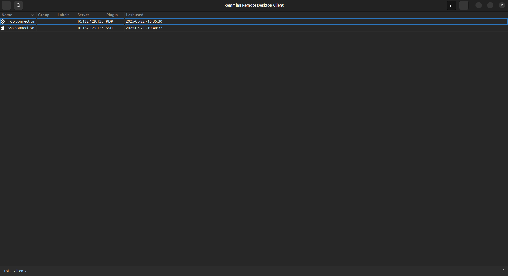
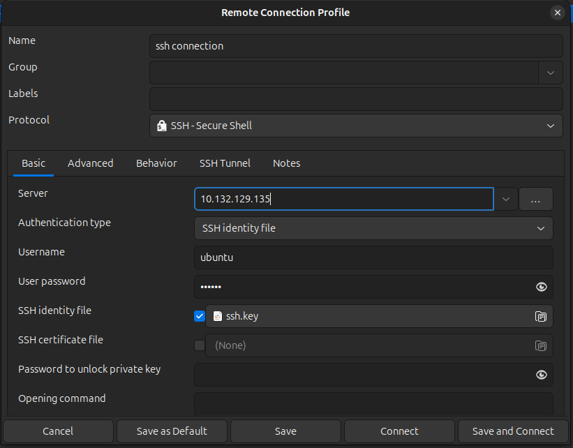
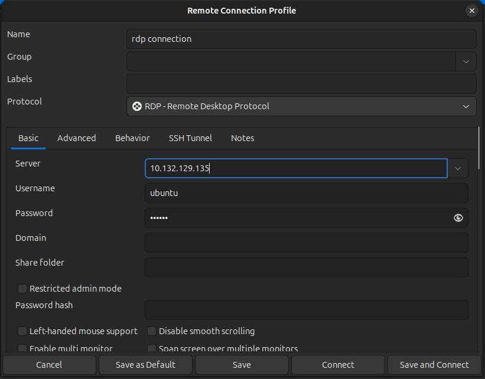
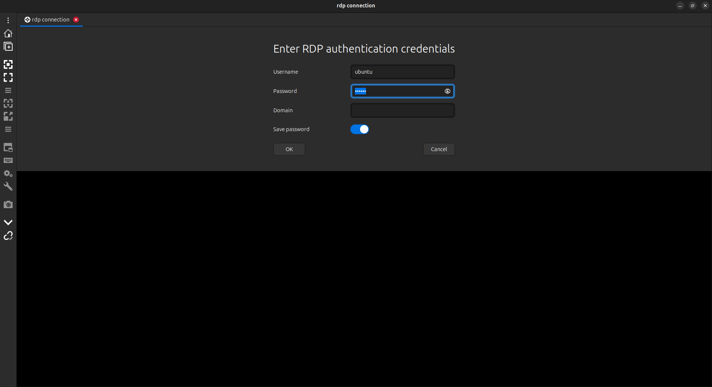
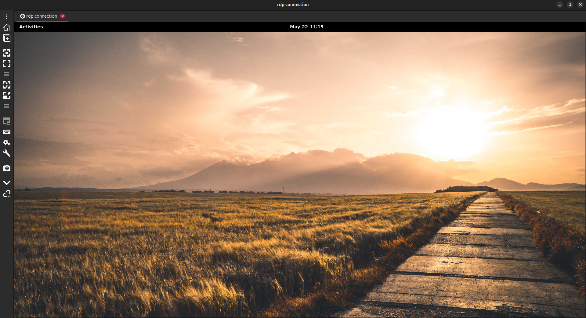
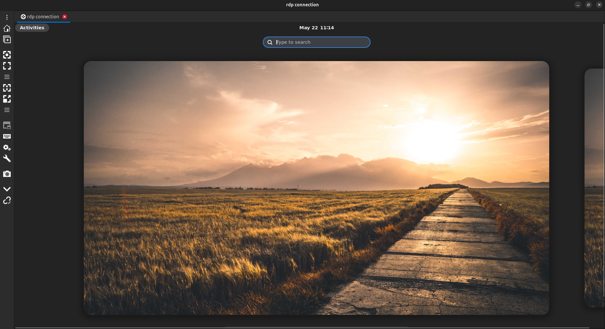

# Remmina Setup Guide

Install Remmina on Ubuntu from the official PPA:

```bash
sudo apt update
sudo apt upgrade
sudo add-apt-repository ppa:remmina-ppa-team/remmina-next
sudo apt update
sudo apt install remmina
```

**Remmina GUI:**



## SSH Connection

To connect to a Multipass VM using SSH:

1. Open Remmina and create a new connection.
2. In the **Server** field, enter the VM's IP address.
3. Set **Authentication type** to `SSH identity file`.
4. Enter the VM's **username**.
5. Leave **User password** blank (if using an identity file).
6. Set the **SSH identity file** to the path of your private SSH key (e.g., `~/.ssh/id_rsa`).
7. Save the configuration and connect.

**Sample SSH Configuration:**



## RDP Connection

To connect to a Multipass VM using RDP:

1. Open Remmina and create a new connection.
2. In the **Server** field, enter the VM's IP address.
3. Enter the VM's **username** and **password**.
4. Under **Resolution**, set a custom resolution with appropriate dimensions (e.g., 1920×1080).
5. Save the configuration and connect.

**Sample RDP Configuration:**



RDP authentication credentials:



RDP Desktop GUI:



Search for application: **Activities >> Search Bar**

